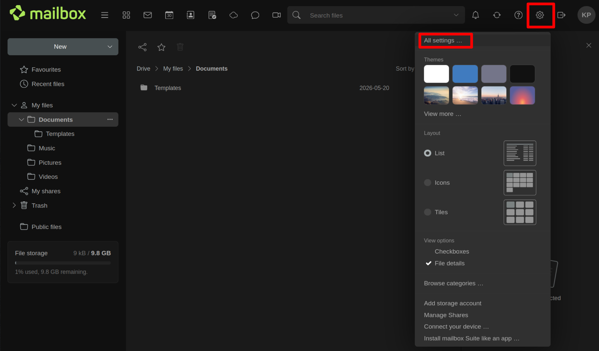
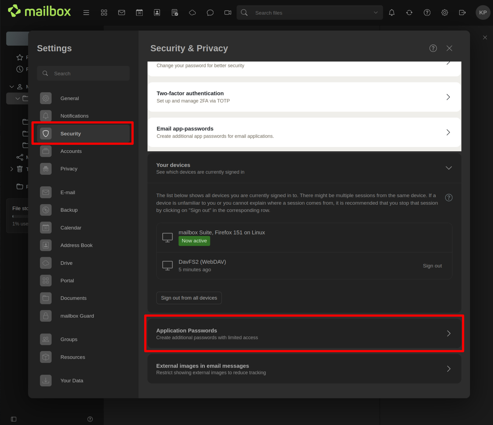
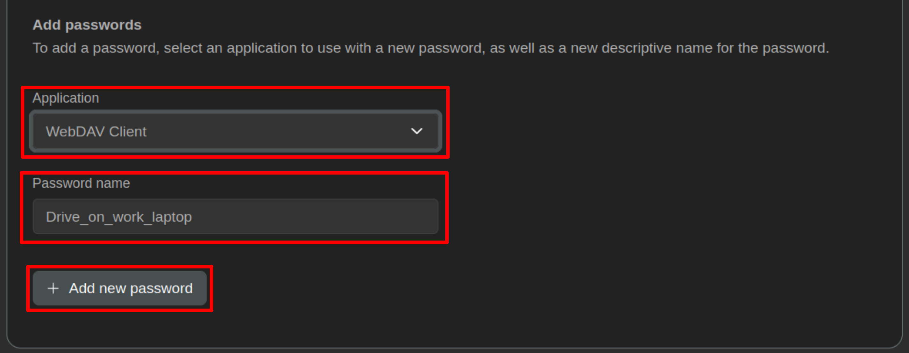

# mailbox.org Drive Assistant

Automated setup for [mailbox.org Drive](https://mailbox.org) on Ubuntu Linux.

mailbox.org Drive is a cloud-based file storage service. This repository contains shell scripts and configuration templates that automate the otherwise manual process of mounting a remote mailbox.org Drive via WebDAV, creating a synchronised local working directory, and configuring automatic background sync between the remote and local directories.

## How it works

The setup creates two directories on your machine:

| Directory | Purpose |
|---|---|
| `/media/mailboxorg_drive_remote` | A WebDAV mount of your mailbox.org Drive (online) |
| `~/mailboxorg_drive_local` | Your local working directory |

[FreeFileSync](https://freefilesync.org/) and its companion tool RealTimeSync keep these two directories synchronised in the background.

**Why two directories?**

The remote mount (`/media/mailboxorg_drive_remote`) requires an active internet connection. If your device goes offline then any files you save there become inaccessible or fail to sync.

The local directory (`~/mailboxorg_drive_local`) is your actual working directory. Files saved here are always available on your local disk, regardless of connectivity. When the internet is available, RealTimeSync automatically detects changes and synchronises them to the remote drive. This gives you:

- **Offline resilience** — continue working without interruption during connectivity gaps.
- **Redundancy** — files exist in two places (local disk + mailbox.org cloud), protecting against data loss.
- **Automatic sync** — no manual upload/download steps. Changes propagate in both directions.

> **Important:** Always save and edit files in the **local** directory (`~/mailboxorg_drive_local`), not directly in the remote mount. The remote mount is used by the sync process and should not be modified manually.

## Prerequisites

You will need:

- **Ubuntu Linux** (tested on Ubuntu 26.04; should work on recent Ubuntu-based distributions)
- **A mailbox.org account** with Drive access (available on all plans except the Light plan)
- **An app password** for WebDAV access (do **not** use your main mailbox.org login password)

### Creating an app password

1. Log in to your mailbox.org account at [https://login.mailbox.org](https://login.mailbox.org)

2. Click the **gear icon** (⚙) in the top-right corner, then select **All settings...**

   

3. In the left sidebar, select **Security**. Then scroll down and click **Application Passwords**.

   

4. Under **Application**, select **WebDAV Client**. Enter a descriptive password name (for example `Drive_on_work_laptop`). Click **+ Add new password**.

   

5. Copy the generated password and store it in your password manager — you will need it during Drive setup.

> **Note:** App passwords are separate from your main login password. They do not require a second factor login and can be deleted individually without affecting your account access.

## Quickstart

### 1. Clone the repository

```bash
git clone <repository-url> mailboxorg-drive-assistant
cd mailbox-drive-assistant
```

### 2. Run the setup

```bash
./setup.sh
```

The setup script will:

1. **Prompt for configuration** — each setting has a sensible default that you can accept by pressing Enter:

   | Setting | Default |
   |---|---|
   | WebDAV URL | `https://dav.mailbox.org/servlet/webdav.infostore/Userstore` |
   | Mount point | `/media/mailboxorg_drive_remote` |
   | Local directory | `~/mailboxorg_drive_local` |
   | FreeFileSync version | `14.9` |
   | Install directory | `~/programs/FreeFileSync` |
   | Sync delay | `1` second |

2. **Ask for your mailbox.org email and app password** — the password is entered securely (not shown on screen, not stored in shell history).

3. **Install davfs2** for WebDAV access.

4. **Download and install FreeFileSync** — the installer will launch interactively. Follow the on-screen instructions:
   - Press **y** to accept the license
   - Press **1** to install for the current user only
   - Press **2** to set the installation directory (the correct path will be displayed and copied to your clipboard)
   - Press **3** to skip desktop shortcut creation
   - Press **Enter** to install

5. **Configure davfs2** — credentials, fstab, permissions.

6. **Mount the drive and auto-detect your mailbox display name** (the folder inside the drive that contains your files, typically your full name).

7. **Generate FreeFileSync sync configuration** from templates.

8. **Create autostart entries** so the drive mounts and sync starts automatically on every login.

9. **Activate immediately** — mount the drive and start RealTimeSync right away.

After setup completes, you should see two red arrows in your taskbar indicating that RealTimeSync is monitoring for changes.

### 3. Start working

IMPORTANT: Work and save files in your local drive directory to prevent data loss. Do not work in your remote directory directly as you might not be able to write files to the directory when an internet connection is not available.

```bash
# Work in your local drive directory
~/mailboxorg_drive_local
```

RealTimeSync will automatically synchronise changes to your mailbox.org Drive. When sync is active, the red arrows in the taskbar briefly turn green.

### 4. Restarting sync (if needed)

If RealTimeSync was accidentally closed or you need to restart synchronisation:

```bash
./start-sync.sh
```

This script will mount the drive if needed, stop any existing RealTimeSync instance, and start a fresh one.

### 5. Uninstalling

To completely remove the mailbox.org Drive setup:

```bash
./uninstall.sh
```

The uninstall script will:

- Stop RealTimeSync and unmount the drive
- Remove autostart entries and helper scripts
- Remove the fstab entry and stored credentials
- Optionally restore the original davfs2 configuration
- Optionally remove the user from the davfs2 group
- Optionally remove the mount point directory
- Optionally remove the local sync directory (**warning: this deletes your local files**)
- Optionally remove FreeFileSync (using its built-in uninstaller when available)
- Optionally uninstall the davfs2 system package

Each destructive action requires explicit confirmation. Safe to run even if the setup was only partially completed.

## Repository contents

```
mailbox-drive-assistant/
├── README.md                          # This file
├── LICENSE                            # MIT License
├── drive.conf                         # Default configuration (no secrets)
├── setup.sh                           # Main setup script
├── uninstall.sh                       # Complete removal script
├── start-sync.sh                      # Manual sync start/restart
├── templates/
│   ├── BatchRun.ffs_batch             # FreeFileSync batch job template
│   └── BatchRun.ffs_real              # RealTimeSync config template
└── scripts/
    ├── install-deps.sh                # Install davfs2 and FreeFileSync
    ├── configure-davfs.sh             # davfs2.conf, secrets, fstab, SUID, group
    ├── configure-mount.sh             # Create directories, test mount, detect display name
    ├── configure-sync.sh              # Render FreeFileSync/RealTimeSync configs from templates
    └── configure-autostart.sh         # XDG autostart entries and helper scripts
```

### Files created on your system during setup

| File | Purpose |
|---|---|
| `/etc/davfs2/davfs2.conf` | davfs2 configuration (original backed up as `.orig`) |
| `/etc/davfs2/secrets` | WebDAV credentials (permissions: 600, owned by root) |
| `/etc/fstab` | WebDAV mount entry (original backed up as `.bak`) |
| `~/programs/FreeFileSync/` | FreeFileSync and RealTimeSync installation |
| `~/programs/FreeFileSync/BatchRun.ffs_batch` | Sync job configuration |
| `~/programs/FreeFileSync/BatchRun.ffs_real` | RealTimeSync monitoring configuration |
| `~/.local/bin/mount-mailbox-drive` | Helper script to mount the drive at login |
| `~/.local/bin/start-realtimesync-mailbox` | Helper script to start RealTimeSync at login |
| `~/.config/autostart/mount-mailbox-drive.desktop` | XDG autostart entry for mounting |
| `~/.config/autostart/realtimesync-mailbox.desktop` | XDG autostart entry for sync |

## Reference

This setup automates the process described in the official mailbox.org knowledge base article:

> **[The drive under Linux – how to set it up](https://kb.mailbox.org/en/business/drive-article/drive-mount/)**

The article covers manual setup of davfs2 WebDAV access and FreeFileSync synchronisation on Linux. This repository scripts those steps for Ubuntu, adds automatic configuration, and provides setup/uninstall tooling for easy onboarding.

### Key technologies

| Component | Role |
|---|---|
| [davfs2](https://savannah.nongnu.org/projects/davfs2) | Mounts WebDAV shares as local filesystems via FUSE |
| [FreeFileSync](https://freefilesync.org/) | Open-source file synchronisation tool |
| [RealTimeSync](https://freefilesync.org/) | Companion to FreeFileSync; monitors directories and triggers sync on changes |
| [mailbox.org Drive](https://mailbox.org) | Cloud storage with WebDAV access |

## License

[MIT](LICENSE)